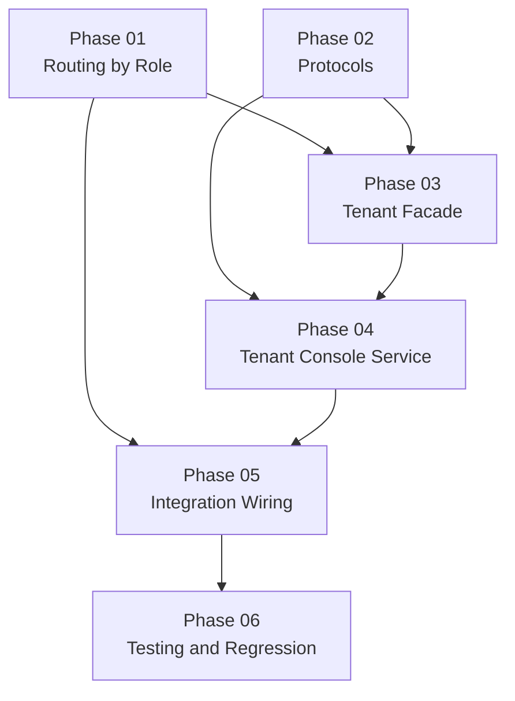

# Implementation Plan: Tenant Admin WhatsApp Console

> Created: 2026-05-18 23:46:52

## Purpose / Big Picture

- Add a tenant-admin WhatsApp console that reuses the existing `/api/v1/integrations/n8n/console` entrypoint and auto-identifies tenant admins by phone, so they can manage tenant-scoped clients, catalog data, and profile settings from WhatsApp without disturbing the Master Console login flow.
- Keep Evolution API and n8n unchanged; all differentiation happens inside the backend role-routing layer.
- Source: [Brainstorm artifacts](../../brainstorms/260518-2146-tenant-admin-whatsapp-console/SUMMARY.md)

## Objective

- Introduce role-aware branching in `backend/app/api/v1/endpoints/integrations.py` so the same webhook can route `master`, `tenant`, `client`, and unknown phones deterministically.
- Add a new `WhatsAppTenantConsoleFacade` plus `WhatsAppTenantConsoleService` that mirror existing Master Console patterns where helpful, but remove credential login, lockout, and auth-session complexity.
- Preserve the current Master Console path as-is from the caller's perspective.
- Add comprehensive regression coverage for endpoint routing, tenant conversation flows, zero-handling, and Redis contingency behavior.
- No schema changes are required. Current data model is by design:
  - `Client` has no `email` — client flow omits email create/view/edit.
  - `Service`/`Plan` have `name` only — catalog editing is limited to `name` changes.
  - Plan price remains out of scope and is never introduced by this plan.

## Context and Orientation

- Relevant docs loaded:
  - `docs/SUMMARY.md`
  - `docs/brainstorms/260518-2146-tenant-admin-whatsapp-console/SUMMARY.md`
  - `docs/brainstorms/260518-2146-tenant-admin-whatsapp-console/section-01-architecture.md`
  - `docs/brainstorms/260518-2146-tenant-admin-whatsapp-console/section-02-conversational-flows.md`
  - `docs/brainstorms/260518-2146-tenant-admin-whatsapp-console/section-03-technical-design.md`
- Relevant files/modules:
  - `backend/app/api/v1/endpoints/integrations.py` — current endpoint only builds the Master Console path inline; there is no existing `_handle_master_console()` helper yet.
  - `backend/app/services/whatsapp_master_console_facade.py` — reference orchestration for contextual `0`, auth-session checks, and failover behavior.
  - `backend/app/services/whatsapp_console_service.py` — reference flow structure, `selection_map`/`temp_data` usage, validation reply style, and `_with_main_menu()` pattern.
  - `backend/app/services/whatsapp_session_service.py` — fixed Redis key prefix `session:`; passing logical phone `admin:{phone}` yields `session:admin:{phone}` without changing the service.
  - `backend/app/services/auth_service.py` — `identify_by_phone()` normalizes phone, sets internal RLS context, returns `{user_id, role, username}`, and already rejects inactive tenant accounts.
  - `backend/app/services/tenant_service.py` — `get_tenant()` accepts either `Tenant.id` or `Tenant.owner_user_id`, which can simplify tenant resolution inside the new facade.
  - `backend/app/services/client_service.py` — supports tenant-scoped client CRUD/lifecycle today, but exposes no client email field.
  - `backend/app/services/catalog_service.py`, `backend/app/models/service.py`, `backend/app/models/plan.py`, `backend/app/schemas/catalog.py` — current catalog stack supports name-only services/plans; there is no persisted description or price.
  - `backend/app/services/profile_service.py`, `backend/app/schemas/me.py` — existing profile read/update/password-change behavior can be reused for the tenant admin flow.
  - `backend/tests/test_whatsapp_endpoint.py` and existing `backend/tests/test_whatsapp_*` flow suites — reference test doubles, fake Redis managers, and service-level conversation testing style.
- Existing patterns to follow:
  - Thin FastAPI endpoints, service-heavy behavior.
  - Spanish user-facing copy.
  - Async SQLAlchemy and Pydantic v2 request/response models.
  - Redis-backed ephemeral conversation state with deterministic contingency replies.
  - Flow handlers that store current state in `ConversationSession.flow`, `step`, `temp_data`, and `selection_map`.
- Constraints, dependencies, and compatibility notes:
  - No Evolution API or n8n workflow changes.
  - No Master Console refactor beyond whatever minimal extraction is needed to support endpoint branching cleanly.
  - `backend/pyproject.toml` does not currently include `mypy`; protocol validation must rely on import/runtime checks unless the executor explicitly adds a local type-check step.

## Scope

### In scope

- Role-based bifurcation inside `POST /api/v1/integrations/n8n/console`.
- New tenant-only WhatsApp facade and conversation service.
- Protocol abstractions for `ClientService` and `CatalogService` injection.
- Tenant-scoped flows for clients, catalog viewing/editing, profile, help, and contextual `0` handling.
- `session:admin:{phone}` namespacing via logical phone key usage.
- Endpoint and unit test coverage for the new behavior.

### Out of scope

- New n8n workflow, new Evolution trigger, or new backend endpoint.
- Tenant login flow, lockout, or `WhatsAppAuthSessionService` for tenant admins.
- Catalog creation/deletion through WhatsApp.
- Plan price creation, storage, or editing.
- Frontend/dashboard changes.
- Master Console behavior changes beyond preserving compatibility while branching.

## Architecture & Approach

### Overview / Resumen

- Keep one webhook transport and one backend endpoint.
- Identify the caller once at the transport edge, then route by role.
- Give tenant admins a separate facade/service pair so Master logic stays isolated.
- Reuse the existing Redis session service by namespacing the logical phone key with `admin:`.

### Architecture diagram

```mermaid
flowchart LR
    WA[WhatsApp user sends /menu] --> EVO[Evolution API]
    EVO --> N8N[Existing n8n workflow]
    N8N --> API[POST /api/v1/integrations/n8n/console]
    API --> ROLE{identify_by_phone() role}
    ROLE -->|master| MASTER[WhatsAppMasterConsoleFacade]
    ROLE -->|tenant| TENANT[WhatsAppTenantConsoleFacade]
    ROLE -->|client| REJECT1["Esta consola es solo para administradores"]
    ROLE -->|unknown| REJECT2["No tienes acceso a la consola"]

    TENANT --> SESS[WhatsAppSessionService\nsession:admin:{phone}]
    TENANT --> TCS[WhatsAppTenantConsoleService]
    TCS --> CLIENTS[ClientService / ClientServiceProtocol]
    TCS --> CATALOG[CatalogService / CatalogServiceProtocol]
    TCS --> PROFILE[ProfileService]
```

### Phase dependency graph



- Design decisions and rationale:
  - Route inside the existing endpoint instead of creating parallel transports.
  - Keep Master and Tenant consoles separated at the service/facade level to reduce regression risk.
  - Reuse `WhatsAppSessionService` unchanged by using `admin:{phone}` as the logical session key component.
  - Use `temp_data` and `selection_map` for selected client/service/plan context rather than overloading `ConversationSession.selected_tenant_id`.
  - Keep plan price out of scope; if the final tenant plan detail view needs price later, that should be a separate feature.
- **Mandatory finding**: `integrations.py` builds the Master path inline. Phase 01 MUST extract it into `_handle_master_console()` with no behavior change before adding the tenant branch.

## Progress

- [ ] Plan approved for execution.
- [x] Phase 1 complete.
- [x] Phase 2 complete.
- [x] Phase 3 complete.
- [x] Phase 4 complete.
- [x] Phase 5 complete.
- [x] Phase 6 complete.
- [x] Final verification complete.

## Phases

- [x] **Phase 1 [S]: Routing by Role** — Add role-based branching in `/n8n/console` while preserving the Master path.
- [x] **Phase 2 [S]: Protocols** — Define injectable client/catalog service contracts for the new tenant console.
- [x] **Phase 3 [M]: Tenant Facade** — Add auto-auth tenant facade orchestration, tenant resolution, and top-level exit handling.
- [x] **Phase 4 [XL]: Tenant Console Service** — Implement tenant conversation flows for clients (sin email), catalog (solo nombre), profile, and help.
- [x] **Phase 5 [S]: Integration Wiring** — Export new symbols and connect the real services inside the endpoint path.
- [x] **Phase 6 [L]: Testing and Regression** — Add dedicated tenant-console tests and update endpoint regressions.

## Key Changes

### File inventory

- Required new files:
  - `backend/app/services/tenant_console_protocols.py`
  - `backend/app/services/whatsapp_tenant_console_facade.py`
  - `backend/app/services/whatsapp_tenant_console_service.py`
  - `backend/tests/test_tenant_console_service.py`
- Required modified files:
  - `backend/app/api/v1/endpoints/integrations.py`
  - `backend/app/services/__init__.py`
  - `backend/tests/test_whatsapp_endpoint.py`
- No schema or model changes are required. Current data model is by design.

### Key decisions from the brainstorm

- Same `/menu` trigger for both Master and Tenant Admin.
- Auto-auth by phone for tenant admins; no credential-login flow.
- New dedicated `WhatsAppTenantConsoleService` instead of extending `WhatsAppConsoleService` in place.
- Use `session:admin:{phone}` for tenant conversation state.
- Catalog scope is read + edit selected fields only; no creation from WhatsApp.
- All user-facing copy stays in Spanish.

## Validation and Acceptance

- Commands:
  - `cd backend && uv run pytest tests/test_tenant_console_service.py tests/test_whatsapp_endpoint.py -q`
  - `cd backend && uv run pytest tests/test_auth.py tests/test_clients.py tests/test_catalog.py tests/test_profile.py -q`
  - `cd backend && uv run pytest -q`
  - No Alembic/schema changes required. Data model is by design.
- Manual checks if needed:
  - Send a tenant-admin phone through the endpoint and confirm a tenant menu reply, not the Master login prompt.
  - Send a client phone and confirm the admin-only rejection.
  - Send `0` at main menu vs inside a flow and confirm exit vs cancel behavior differs correctly.
- Observable acceptance criteria:
  - Master phones still reach the Master Console path.
  - Unknown phones receive a no-access reply.
  - Client-role phones receive an admin-only rejection.
  - Tenant admins can navigate clients, catalog, profile, and help from WhatsApp.
  - Tenant conversation state is isolated from Master state by the `admin:` namespace.
  - Redis failures return the temporary-unavailable reply, never a stateless partial flow.
  - No plan price support is added as part of this feature.

## Idempotence and Recovery

- Safe re-run notes:
  - Pytest commands are safe to rerun.
  - Endpoint tests use fake Redis managers and should remain deterministic.
  - Service-level flow tests should use fake/mocked dependencies, not real Redis.
- Rollback/recovery notes:
  - If routing work is interrupted, keep the current Master inline path intact until tenant branching imports cleanly.
  - No schema changes exist in this feature. Rollback is limited to code changes only.
- Irreversible operations or destructive steps:
  - None expected.

## Dependencies

- No new application packages are required.
- Existing FastAPI, SQLAlchemy async, Pydantic v2, Redis, and pytest stack is sufficient.
- `mypy` is not currently present in `backend/pyproject.toml`; protocol validation should rely on import/runtime checks unless the environment is extended deliberately.

## Risks & Mitigations

- Master path regression → keep Master behavior isolated, leave its facade logic untouched, and update endpoint tests explicitly.
- Session-key collision between Master and Tenant consoles → always use logical key `admin:{phone}` for tenant flows.
- Duplicate `identify_by_phone()` calls across endpoint and facade → choose and document one final strategy; if both remain, treat the facade call as defense in depth and test the expected behavior.
- Brainstorm UX shows sample fields not in data model (Client.email, catalog descriptions, plan price) → these are omitted from the tenant console by design. No schema changes needed.
- Failover or missing session state causes wrong `0` behavior → add explicit tests for top-level exit, in-flow cancel, and backup-Redis/missing-session contingencies.
- New conversation service becomes too monolithic → split into small private handlers by flow and step, mirroring the Master service style.

## Surprises & Discoveries

- 2026-05-18 23:46:52 — `integrations.py` currently does not have the `_handle_master_console()` helper assumed by the brainstorm notes; the Master path is built inline today.
- 2026-05-18 23:46:52 — `TenantService.get_tenant()` already supports lookup by either `Tenant.id` or `Tenant.owner_user_id`, which makes tenant resolution from `identify_by_phone()` simpler.
- 2026-05-18 23:46:52 — Existing endpoint tests explicitly expect unknown and tenant phones to receive the Master login prompt. **These assertions MUST be updated** — they will fail after Phase 01 routing is added. Update them in Phase 01 or Phase 06.
- 2026-05-18 23:46:52 — `Client` has no `email` field, and `Service`/`Plan` are name-only — by design. The tenant console flows are trimmed to match.
- 2026-05-19 08:30:00 — `crud.users.get_by_phone()` did not search `Client.phone`, only `MasterProfile` and `Tenant`. Extended it to search `Client.phone` so client-role phones are properly identified and routed.
- 2026-05-19 08:35:00 — Phase 01 complete. `_handle_master_console()` extracted, `_handle_tenant_console()` stub added, role-based routing via `identify_by_phone()` in place. Endpoint tests updated (23 passed).

## Decision Log

- 2026-05-18 23:46:52 — Decision: keep a single `/api/v1/integrations/n8n/console` endpoint and route by role. Rationale: matches the approved brainstorm and avoids n8n/Evolution changes.
- 2026-05-18 23:46:52 — Decision: add a new tenant-specific facade and conversation service rather than extending the Master Console service in place. Rationale: lower regression risk and clearer role boundaries.
- 2026-05-18 23:46:52 — Decision: reuse `WhatsAppSessionService` unchanged by passing `admin:{phone}` as the logical phone key. Rationale: yields `session:admin:{phone}` with no Redis service refactor.
- 2026-05-18 23:46:52 — Decision: keep tenant console auth phone-based only; `0` clears conversation state, not a credential-auth session. Rationale: approved auto-auth model.
- 2026-05-18 23:46:52 — Decision: do not add plan price as part of this feature. Rationale: current product/catalog scope remains name-only pricing-free, and the brainstorm only approved field edits for names.
- 2026-05-19 00:45:00 — Decision: Findings 1 (Client.email) and 2 (catalog descriptions) are invalidated — system is intentionally designed that way. No schema changes. Conversational flows trimmed to match.
- 2026-05-19 00:45:00 — Decision: Finding 3 (inline Master path) resolved — Phase 01 now mandates extraction of `_handle_master_console()` helper before adding tenant branch.
- 2026-05-19 00:45:00 — Decision: Finding 4 (existing endpoint tests expect Master login for unknown/tenant phones) resolved — Phase 01 and Phase 06 both call out explicit test updates. Tests WILL fail if not updated synchronously with routing changes.
